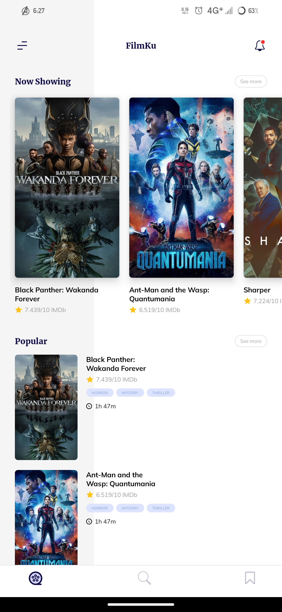
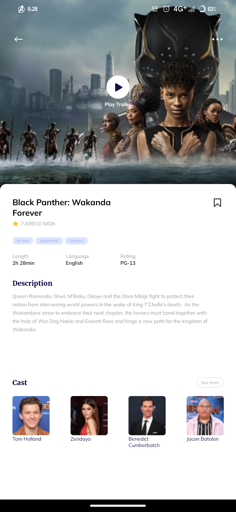
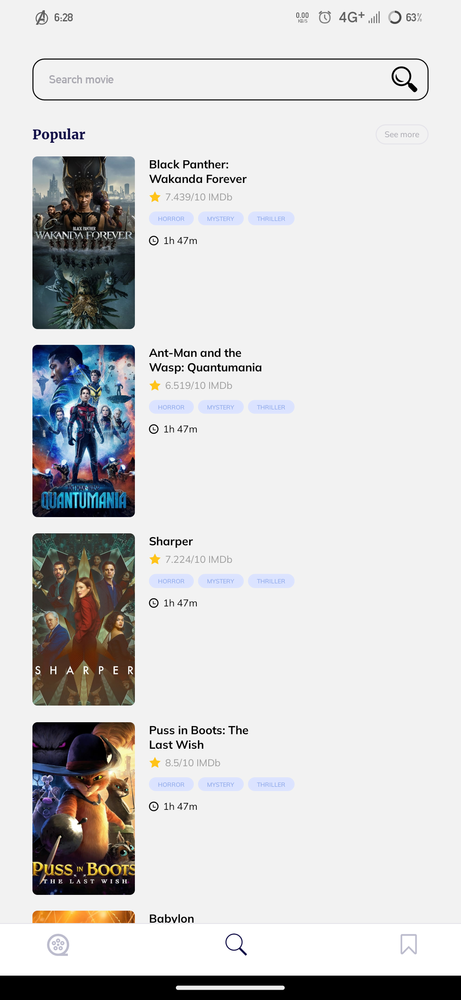
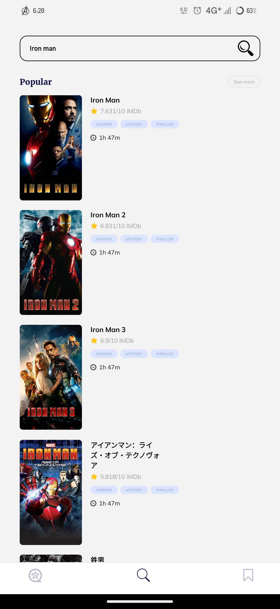

## TMBD Movies app

_This mobile application is to search trending movies and know about them._

### Description

- A application where you can search trending movies, know their IMDb rating.
- In this application you can also read a little description of the story of that movie.

## Tech Stack

 

 

## Screenshots

  

#### HomeScreen

#### DescriptionScreen

#### SearchScreen

#### SearchResult

# Run Instructions

git clone https://github.com/lekhrajsaini0/TMDB-AH.git rnmovies
 
cd rnmovies && (npm i || yarn)

# Running

yarn (android || ios)
